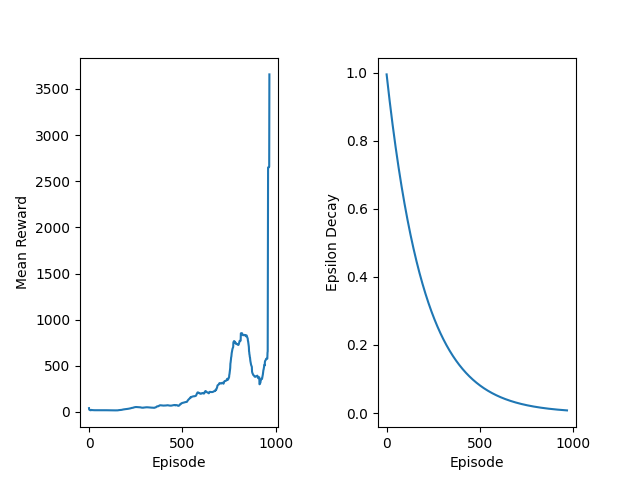

# Double DQN for Cartpole balancing

This repository contains an implementation of the Double DQN algorithm for solving the Cartpole balancing problem. The code is written in Python and uses the PyTorch library for deep learning.

<video controls src="Cartpole.mp4" title="Title"></video>

## Introduction
The Cartpole problem is a classic reinforcement learning task where the goal is to balance a pole on a cart by applying forces to the cart. The agent receives a reward for keeping the pole balanced and is penalized for letting it fall. The Double DQN algorithm is an improvement over the traditional DQN algorithm, which helps to reduce overestimation bias in action value estimates.

## Implementation
The implementation consists of the following components:
- CP_policy.py: Contains the implementation of the DQN policy.
- CP_memory.py: Contains the implementation of the replay buffer for storing experience tuples.
- CP_agent.py: Contains the training loop, double DQN algorithm and evaluation logic.
- best_model.pth: The saved weights of the best model best reward after training.

## DQN
The DQN algorithm uses a neural network to approximate the action-value function. The agent interacts with the environment, collects experience tuples (state, action, reward, next state), and stores them in a replay buffer. During training, the agent samples mini-batches of experience from the replay buffer and updates the neural network weights using the Bellman equation.

        DQN target formula:
        
        Qt[state, action] = reward if next state is terminal else
                            reward +  discount factor * max(Qt[next state, all actions])
        

## Double DQN
The Double DQN algorithm addresses the overestimation bias in action value estimates by decoupling the action selection and action evaluation steps. In Double DQN, the action selection is done using the current Q-network, while the action evaluation is done using a target Q-network. This helps to provide more accurate estimates of the action values and improves the stability of training.

            Double DQN target formula:
            
            best action = argmax(Q_current[next state, all actions])

            Qt[state, action] = reward if next state is terminal else
                                reward +  discount factor * Q_target[next state, best action]

## Epsilon-greedy policy
The agent uses an epsilon-greedy policy for action selection. With probability epsilon, the agent selects a random action, and with probability (1 - epsilon), it selects the action with the highest estimated value from the Q-network. The epsilon value is decayed over time to encourage exploration in the early stages of training and exploitation in the later stages.

        if rand() < epsilon:
            action = random_action()
        else:
            action = argmax(Q_network(state))  [best action]
        
        decrease epsilon over time

## Optimizer
The Adam optimizer is used for updating the neural network weights. It is an adaptive learning rate optimization algorithm that computes individual learning rates for each parameter based on the first and second moments of the gradients.

## Mean reward and Epsilon decay

## Conclusion
The Double DQN algorithm provides a more stable and accurate approach to solving the Cartpole balancing problem compared to the traditional DQN algorithm. By decoupling action selection and evaluation, it helps to reduce overestimation bias and improve the performance of the agent. The implementation in this repository demonstrates how to apply Double DQN to the Cartpole problem using PyTorch.